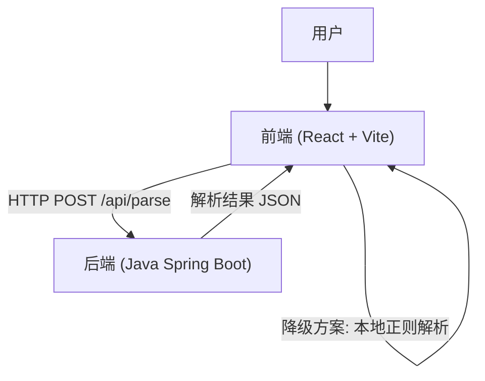

# SQL流程图生成器 (SQL to ETL Flowchart Generator) 项目说明文档

## 1. 项目背景

### 1.1 背景与痛点
在数据仓库开发和ETL（Extract, Transform, Load）过程中，工程师经常需要编写和维护长达数百甚至数千行的SQL脚本。这些脚本通常包含复杂的逻辑，如多层嵌套的子查询、公用表表达式（CTE）、临时表创建（Create Table As Select）、以及各种类型的连接（JOIN）和集合操作（UNION）。

直接阅读源码来理解数据流向和处理逻辑存在以下困难：
*   **逻辑晦涩**：嵌套层级过深，难以理清数据来源和去向。
*   **依赖复杂**：难以快速识别表与表之间的依赖关系，尤其是在涉及临时表和多步处理时。
*   **沟通成本高**：在进行代码评审或交接时，纯文本代码难以直观传达业务逻辑。

### 1.2 解决方案
本项目提供了一款可视化的SQL流程图生成器，具有极高的实用价值：
*   **双引擎解析**：结合 Java 后端（JSqlParser）的精准解析和前端（TypeScript/Regex）的轻量级容错解析，确保各种复杂 SQL 都能被正确识别。
*   **自动化绘图**：自动生成清晰的 ETL 数据流向图，瞬间理清代码逻辑。
*   **文档化与排错**：生成的流程图可直接作为技术文档，并辅助发现逻辑断层。

---

## 2. 项目架构与组成

本项目采用 **前后端分离** 架构，确保了解析能力的强大与用户体验的流畅。

### 2.1 架构图


### 2.2 核心模块
1.  **前端 (Frontend)**
    *   **技术栈**：React, TypeScript, Vite, ReactFlow, TailwindCSS
    *   **职责**：提供代码编辑界面，展示交互式流程图，处理用户操作。
    *   **特色**：内置了纯前端解析逻辑作为降级方案，即使后端不可用也能处理简单 SQL。

2.  **后端 (Backend)**
    *   **技术栈**：Java 17, Spring Boot 3, JSqlParser 4.8
    *   **职责**：提供高性能、高精度的 SQL 解析服务。
    *   **特色**：利用专业的 AST 解析库，能够完美处理多层嵌套子查询、复杂 JOIN 和集合运算。

---

## 3. 目录结构与文件说明

项目根目录结构如下：

```
SQL流程图生成器_v11/
├── app/
│   ├── backend/               # Java 后端项目
│   │   ├── src/main/java/     # Java 源代码
│   │   │   └── com/sqlflow/backend/
│   │   │       ├── controller/# API 接口层 (SqlParserController)
│   │   │       ├── service/   # 业务逻辑层 (SqlParserService - 核心解析逻辑)
│   │   │       └── model/     # 数据模型 (ParsedSQL, SubQuery 等)
│   │   ├── pom.xml            # Maven 依赖配置
│   │   └── run_backend.sh     # 【推荐】后端一键启动脚本
│   │
│   └── frontend/              # React 前端项目
│       ├── src/
│       │   ├── components/    # UI 组件 (SqlEditor, FlowChart, QueryNode 等)
│       │   ├── lib/           # 工具库 (flowLayoutEngine 布局引擎, sqlParser 前端解析器)
│       │   └── pages/         # 页面文件 (Index.tsx)
│       ├── package.json       # 前端依赖配置
│       └── vite.config.ts     # Vite 构建配置 (包含代理设置)
│
├── node-v18.16.0-darwin-arm64/# (可选) 内置 Node.js 环境
└── setup_env.sh               # 环境初始化脚本
```

---

## 4. 快速运行指南 (小白版)

无论您是 Windows 还是 macOS 用户，请按照以下步骤操作。

### 4.1 准备工作
确保您的电脑上安装了以下基础软件：
*   **Java 17+**：用于运行后端解析服务。
    *   验证：打开终端输入 `java -version`
*   **Node.js 18+**：用于运行前端界面。
    *   验证：打开终端输入 `node -v`

### 4.2 步骤一：启动后端服务 (Java)

后端负责核心的 SQL 解析功能。我们提供了自动脚本，无需手动配置 Maven。

1.  打开终端 (Terminal 或 CMD)。
2.  进入项目根目录。
3.  运行启动脚本：
    ```bash
    # macOS / Linux
    chmod +x app/backend/run_backend.sh
    ./app/backend/run_backend.sh
    ```
    *(脚本会自动下载 Maven 并启动服务)*

    **成功标志**：看到日志 `Started SqlFlowBackendApplication`，且监听端口 `8080`。

### 4.3 步骤二：启动前端服务 (Web)

1.  打开一个新的终端窗口。
2.  进入前端目录并安装依赖：
    ```bash
    cd app/frontend
    npm install
    # 或者如果您安装了 pnpm (推荐):
    # pnpm install
    ```
3.  启动网页：
    ```bash
    npm run dev
    # 或者: pnpm run dev
    ```

    **成功标志**：终端显示 `Local: http://localhost:3005` (端口可能会变化)。

### 4.4 步骤三：开始使用

1.  打开浏览器，访问前端终端显示的地址 (例如 `http://localhost:3005`)。
2.  在左侧输入框粘贴您的 SQL 代码。
3.  点击 **"生成流程图"**。
    *   系统会优先调用 Java 后端进行精准解析。
    *   解析成功后，右侧会自动绘制出 ETL 流程图。

---

## 5. 进阶功能说明

### 5.1 解析能力
*   **CTE (公用表表达式)**：完美支持 `WITH ... AS (...)`，识别为独立节点。
*   **嵌套子查询**：支持 `FROM (SELECT ...)` 和 `JOIN (SELECT ...)`，后端引擎可递归解析任意层级的子查询。
*   **临时表**：支持 `CREATE TABLE AS SELECT ...` 语法。
*   **智能分类**：自动根据表名识别事实表（包含 `fact`, `dwd`, `dws` 等）和维度表（`dim` 等）。

### 5.2 故障降级
如果您的 Java 后端未启动或发生错误，前端会自动切换到**内置的正则解析引擎**。虽然解析精度不如后端（特别是在处理复杂嵌套时），但仍能处理大多数标准 SQL 查询，确保基本功能可用。

### 5.3 端口配置
*   **前端**：默认端口 `3005` (可在 `vite.config.ts` 中修改)。
*   **后端**：默认端口 `8080` (可在 `app/backend/src/main/resources/application.properties` 中修改)。
*   **代理**：前端通过 `/api` 路径自动转发请求到后端，无需处理跨域问题。
